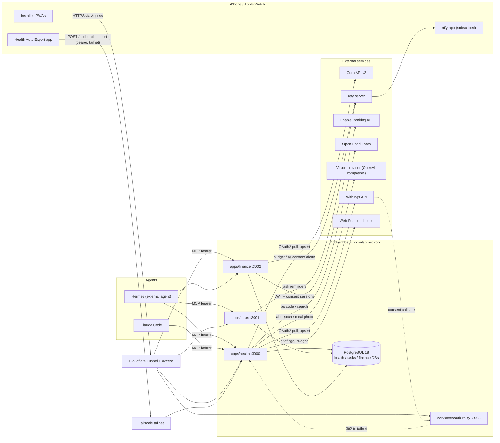
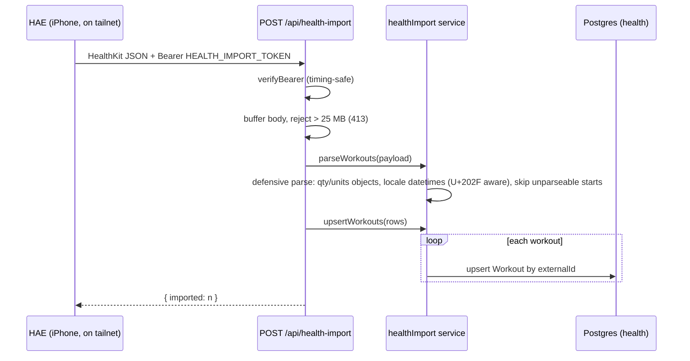
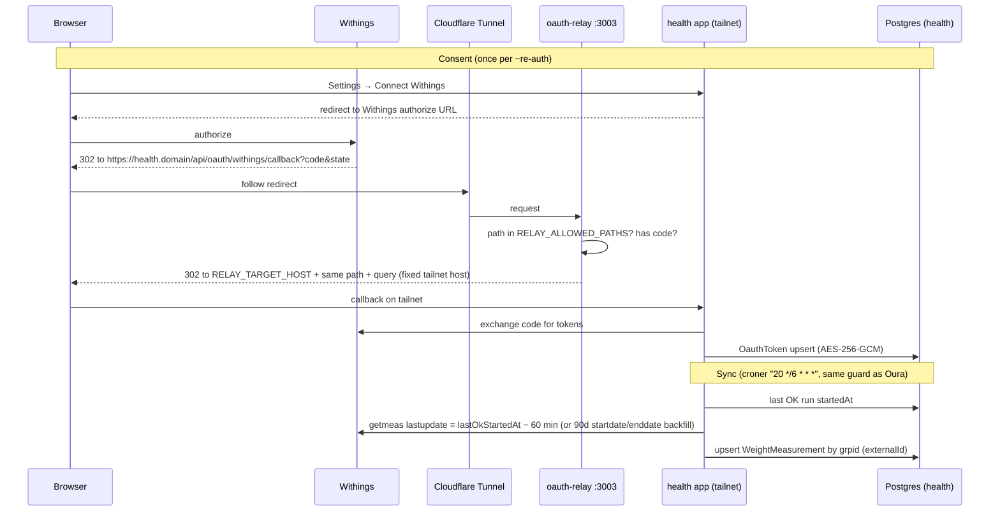

# Architecture

> System document for the `dashboards` monorepo. Written for a competent developer
> (or a future AI coding session) who has never seen this repo and needs to
> understand the whole system before reading the code. Every claim references the
> file it was verified against. Anything the code could not confirm is listed in
> [§11 Known gaps](#11-known-gaps--unclear-areas).
>
> Generated 2026-07-13 from the repo state on branch `docs/architecture-review`
> (main @ `1b6f3c0`).

---

## Table of contents

1. [System overview](#1-system-overview)
2. [High-level diagram](#2-high-level-diagram)
3. [Monorepo layout](#3-monorepo-layout)
4. [Data model](#4-data-model)
5. [Data flows](#5-data-flows)
6. [MCP layer](#6-mcp-layer)
7. [Auth & network exposure](#7-auth--network-exposure)
8. [Deployment & runtime](#8-deployment--runtime)
9. [Cross-cutting conventions](#9-cross-cutting-conventions)
10. [How it all fits together](#10-how-it-all-fits-together)
11. [Known gaps & unclear areas](#11-known-gaps--unclear-areas)

---

## 1. System overview

This repo is a **personal homelab platform**: a pnpm monorepo of three
single-user, self-hosted, mobile-first PWAs, each of which also exposes an **MCP
server** so AI agents (the owner's personal agent **Hermes**, and Claude Code)
can operate it programmatically. One shared PostgreSQL server backs all apps,
with hard per-app database isolation (`CLAUDE.md`, `README.md`).

**apps/health** (host port 3000) — the largest app (~47k LOC excluding generated
code). A health dashboard unifying *pulled* wearable data (Oura sleep/readiness/
activity via OAuth2, Withings body composition via OAuth2), *pushed* Apple Watch
workouts (Health Auto Export POSTs HealthKit JSON to a bearer-guarded ingest
endpoint), and *manual* logs (food, water, stimulants/caffeine, supplements,
lifting). It layers insights on top: a `daily_summary` SQL view, trends, weekly
review, correlational observations, empirical TDEE estimation, recovery status,
and a scheduled briefing/notification system over Web Push. Food logging is
backed by an Open Food Facts product cache and an optional OpenAI-compatible
vision provider for label scans and meal-photo estimates (draft-only, never
persisted without confirmation). Its MCP server exposes **72 tools**
(`apps/health/src/mcp/`).

**apps/tasks** (host port 3001, ~11k LOC) — a Todoist-style task manager:
projects/sections/subtasks, labels, saved filters with a hand-rolled filter
language (`apps/tasks/src/lib/filterlang/`), hand-rolled RFC 5545 recurrence
(`apps/tasks/src/lib/recurrence/`, DST-safe, no rrule lib), fractional-indexing
ordering, quick-add natural-language parsing (chrono-node), and reminders
dispatched to **ntfy** by a once-a-minute in-process worker. Its MCP server
exposes **10 tools** (`apps/tasks/src/server/mcp/tools.ts`).

**apps/finance** (host port 3002, ~8k LOC) — a personal finance dashboard.
Banks (ING NL, Revolut; the code also wires Klarna — see §11) connect through
the **Enable Banking** PSD2 aggregation API in restricted/personal mode: RS256
JWT app auth, user consent flow, ~180-day sessions. A 6-hourly sync ingests
transactions idempotently, then enriches them (merchant normalization →
rule-based auto-categorization → internal-transfer pairing → recurring-series
detection). Budgets with 80%/100% ntfy alerts, subscriptions, net worth. Its MCP
server exposes **6 tools**, deliberately 5 reads + 1 metadata write
(`apps/finance/src/mcp/server.ts`).

**Hermes** is *not* in this repo. It is an external personal agent that consumes
the three MCP endpoints over the network, exactly like Claude Code does
(`apps/health/README.md:89-101`, `apps/tasks/README.md:37-50`). Everything this
platform can guarantee about agent behavior therefore lives in the MCP tool
*surfaces* (which tools exist at all), the tool *code* (validation, ambiguity
refusal, no-side-effect drafts), and the tool *descriptions* (instructions the
agent is expected to follow). §6 maps Hermes' behavioral rules onto those three
enforcement levels.

Supporting pieces:

- **infra/postgres** — the shared PostgreSQL 18 server (compose file,
  per-service DB provisioning script, nightly backup script + systemd units).
- **packages/migrate** — a dependency-only workspace package (`prisma` +
  `dotenv`) that gives every app container a self-contained
  `prisma migrate deploy` at boot.
- **services/oauth-relay** — a dependency-free Node HTTP relay (host port 3003)
  that gives OAuth providers requiring a *publicly reachable* callback (Withings)
  a stable public URL behind a Cloudflare Tunnel, and bounces the browser to the
  tailnet-private health app (`services/oauth-relay/server.js`).

---

## 2. High-level diagram



Notes on the picture:

- Each app owns exactly one database on the shared server (plus a `_dev` twin);
  `CONNECT` is revoked from `PUBLIC` per database, so isolation is enforced by
  Postgres, not convention (`infra/postgres/scripts/create-service.sh`).
- Apps never import each other's code or query each other's databases; the only
  sanctioned integration path between apps is their MCP/HTTP APIs (`CLAUDE.md`).
  As of today no app actually calls another app.
- The MCP endpoints are reached two different ways: health documents LAN/
  Tailscale-only access, while tasks documents access through its Cloudflare
  domain (see §7 — this asymmetry is real, not a typo).

---

## 3. Monorepo layout

```
dashboards/
├── CLAUDE.md                  # platform conventions (isolation, MCP pattern, mobile-first, DB safety)
├── README.md                  # one-command bring-up, app/port table
├── compose.yaml               # unified app stack: tasks, finance, health, oauth-relay (NOT postgres)
├── package.json               # root scripts (note: they hardcode --filter tasks; see review)
├── pnpm-workspace.yaml        # workspaces: apps/*, packages/* (services/ is NOT a workspace)
├── scripts/
│   ├── up.sh                  # idempotent provisioner: network, postgres, DBs, secrets, build+start
│   └── down.sh                # docker compose down (leaves shared postgres running)
├── docs/
│   └── ENVIRONMENT.md         # how to obtain every env value; per-app reference tables
├── infra/postgres/
│   ├── compose.yaml           # postgres:18-alpine, pgdata volume, ./backups bind mount, homelab net
│   ├── scripts/create-service.sh  # mints role <name>_app + database <name>, revokes PUBLIC connect
│   ├── scripts/backup.sh      # pg_dump -Fc every service DB to /backups, 14-day retention
│   └── systemd/               # postgres-backup.{service,timer} — nightly 03:30, Persistent=true
├── packages/
│   └── migrate/               # deps-only package (prisma, dotenv) — migrate-on-boot toolchain
├── services/
│   └── oauth-relay/           # dependency-free public OAuth callback relay (see §5.3, §7)
└── apps/
    ├── health/
    ├── tasks/
    └── finance/
```

Every app follows the same internal shape (health shown; tasks/finance differ
only in the details noted):

```
apps/health/
├── CLAUDE.md                  # domain guardrails (non-negotiable rules; see §6/§9)
├── README.md                  # operator guide: deploy, env, MCP-over-LAN
├── Dockerfile                 # 4-stage: base → builder → deployer → runner (see §8)
├── docker-entrypoint.sh       # prisma migrate deploy, then node apps/health/server.js
├── docker-compose.yml         # legacy single-app compose (root compose.yaml supersedes; see §11)
├── .env.example / .env.production.example   # committed templates; real files gitignored
├── prisma/
│   ├── schema.prisma          # 39 models, 9 enums
│   ├── views/daily_summary.sql# canonical view definition (copied into migrations)
│   └── migrations/            # 20 migrations (tasks: 4, finance: 4)
└── src/
    ├── app/                   # Next.js App Router; (app)/ pages + api/ route handlers
    │   └── api/mcp/route.ts   # the MCP endpoint (bearer-gated POST)
    ├── instrumentation.ts     # Next startup hook → starts the in-process scheduler/worker
    ├── server/
    │   ├── db.ts              # Prisma client (adapter-pg), reads DATABASE_URL
    │   ├── scheduler.ts       # croner jobs (health only)
    │   ├── services/          # ALL business logic lives here (platform rule)
    │   └── integrations/      # raw vendor API clients (oura.ts, withings.ts) — health only
    ├── mcp/                   # MCP server assembly + tools (tasks keeps this in server/mcp/)
    │   ├── auth.ts            # timing-safe bearer compare
    │   ├── server.ts          # buildServer(): registers all tool modules
    │   └── tools/             # 8 domain tool files (72 tools)
    ├── lib/
    │   ├── dates.ts           # THE day-bucketing chokepoint (Europe/Amsterdam)
    │   └── schemas/           # Zod schemas — single source of truth for all inputs
    ├── generated/prisma/      # generated Prisma client (gitignored)
    └── sw.ts                  # serwist service worker (PWA)
```

Where new code goes (platform rules, `CLAUDE.md`):

- Business logic → `src/server/services/` of the owning app. Route handlers,
  server actions, and MCP tools are thin adapters over the same service
  functions — logic is never duplicated across them.
- Input validation → Zod schemas in `src/lib/schemas/`, reused by server
  actions/route handlers *and* MCP tools.
- A shared `packages/*` package is created only when two apps genuinely
  duplicate code, and only after asking the owner (`CLAUDE.md`). Today the only
  shared package is the deps-only `packages/migrate`.
- `services/` (outside the pnpm workspace) is for infrastructure sidecars that
  are not Node workspaces at all — currently only `oauth-relay`.

Structural differences between the apps worth knowing:

| Aspect | health | tasks | finance |
|---|---|---|---|
| MCP code location | `src/mcp/` | `src/server/mcp/` | `src/mcp/` |
| MCP transport | raw SDK `WebStandardStreamableHTTPServerTransport` (`src/app/api/mcp/route.ts`) | `mcp-handler` wrapper (`src/app/api/mcp/route.ts`) | raw SDK, same as health (`src/app/api/mcp/route.ts`) |
| MCP SDK version | `^1.29.0` | `1.26.0` (pinned) + `mcp-handler ^1.1.0` | `^1.29.0` |
| UI mutations | route handlers under `src/app/api/**` + TanStack Query | server actions (`src/server/actions/`) | server actions (`src/server/actions/`) + some route handlers |
| Scheduler | croner via `instrumentation.ts`, gated by `ENABLE_SCHEDULER=true` | node-cron via `instrumentation.ts`, gated by `RUN_WORKER=1` | node-cron via `instrumentation.ts`, **no env gate** |
| Vendor clients | `src/server/integrations/` | — (ntfy helper in `src/lib/ntfy.ts`) | `src/server/services/enable-banking/` |

---

## 4. Data model

All three schemas: Prisma 7 (`prisma-client` generator, output to
`src/generated/prisma`, datasource URL via `prisma.config.ts`). All money and
body metrics are `Decimal`, never floats (exception: `Workout.distance` /
`activeEnergyKcal` are `Float` on purpose — wearable estimates,
`apps/health/prisma/migrations/20260702120000_schema_hygiene_indexes_daily_summary/migration.sql:5-6`).

### 4.1 Health (`apps/health/prisma/schema.prisma` — 39 models, 9 enums, 1 view)

**Provenance is a first-class concept.** Two enums stamp every relevant row:

- `Source` (`WITHINGS | OURA | GOOGLE_HEALTH | MANUAL`, schema.prisma:10-15) —
  *which system produced the measurement*. `GOOGLE_HEALTH` is a legacy/planned
  variant: no code writes it today (see §11).
- `EntryOrigin` (`PWA | MCP`, schema.prisma:17-20) — *which client the user
  logged a manual entry through*. Every manual-log table carries it
  (`FoodEntry.origin`, `WaterEntry.origin`, `StimulantEntry.origin`,
  `LiftingSet.origin`, `SupplementLog.origin`), so agent writes are always
  distinguishable from UI writes.

Domain clusters (model → purpose, keys, provenance):

**Body & sleep (synced + manual fallback)**

| Model | Purpose | Upsert / unique key | Sources |
|---|---|---|---|
| `WeightMeasurement` (63-79) | weight + body-fat/muscle/hydration/bone | `externalId` unique (nullable) | `WITHINGS` (sync, `externalId` = Withings `grpid`) and `MANUAL` (`log_weight`, `externalId` null). Latest `measuredAt` per day wins in the view (`prisma/views/daily_summary.sql` `DISTINCT ON (day)`). |
| `SleepSession` (81-105) | one sleep period: stages, HR, HRV, efficiency | `externalId` unique (nullable since migration `20260704013547`) | `OURA` (sync) and `MANUAL` (fallback via `log_sleep`, which *refuses* days Oura already covers — service-enforced). |
| `DailySleep` (107-114) | Oura daily sleep score | `day` @id | Oura only. |
| `DailyReadiness` (116-126) | Oura readiness score, temp deviation, contributor scores | `day` @id | Oura only. **Caveat:** `restingHrBpm`/`hrvBalance` hold Oura 0–100 *contributor scores*, not raw bpm/ms — column names predate the source (`src/server/services/sync/oura.ts:84-88`). |
| `DailyActivity` (128-138) | active/total kcal + steps per day | `day` @id | Written by the **Oura** sync with `source: OURA` (`src/server/services/sync/oura.ts:108-119`). The schema default `GOOGLE_HEALTH` is legacy (§11). |
| `Workout` (358-378) | Apple Watch cardio workout | `externalId` unique | pushed by HAE, `source: "apple_health"` (string column, not the enum — `schema.prisma:361`). |

**Multi-source overlap, stated precisely:**

- *Weight*: Withings and manual rows coexist in one table; no source preference
  exists — the view takes the latest measurement of the day regardless of
  source, and the 7-day rolling average (`weight_7d_avg`, calendar-day RANGE
  window) denoises the trend.
- *Sleep*: overlap is prevented at write time, in one direction only — a manual
  `log_sleep` for a day that already has an Oura session is refused, and
  `delete_sleep_entry` refuses to delete Oura rows (tool descriptions +
  service, `src/mcp/tools/tracking.ts`). Nothing prevents the *opposite* order
  (Oura later syncing a day that already has a manual entry) from producing two
  sessions on the same day; the view `SUM`s sessions per day
  (`prisma/views/daily_summary.sql` `sleep_daily` CTE), so that day would
  double-count. See the review doc.
- *Activity (steps/kcal)*: single writer today (Oura), one row per day — no
  conflict possible. Apple Watch workout energy lives separately in `Workout`.

**Food & nutrition (snapshot pattern)**

| Model | Purpose |
|---|---|
| `FoodProduct` (140-154) | Open Food Facts cache, `barcode` @id, `per100g` JSON macros |
| `FoodEntry` (156-192) | one diary line; macros (`kcal/proteinG/carbG/fatG`, optional fiber/sugar/salt/caffeine) are **snapshotted at log time** and never recomputed; exactly one source: product barcode, custom food, meal (`portions`), or free-typed `customName` |
| `CustomFood` (194-212) | user-saved foods (`source` = `"LABEL_SCAN" \| "MANUAL"`, Zod-enforced string); `archived` soft-delete |
| `Meal` / `MealItem` (217-268) | saved recipe with `yieldPortions` + `perPortion` macro snapshot; items support nested meals; `@@unique([mealId, position])` |
| `DailyPlan` / `DailyPlanItem` (274-308) | reusable day template; **stores no macros** — items are pure references re-resolved (and snapshotted) when applied |

The snapshot rule (`apps/health/CLAUDE.md`) is the food-domain invariant:
editing a product/custom food/meal never rewrites past diary entries; archiving
never loses history.

**Lifting**

| Model | Purpose |
|---|---|
| `Exercise` (310-319) | catalog, `name` unique, optional `muscleGroup` |
| `LiftingSession` (321-334) | workout container, `day`-indexed, optional `templateId` |
| `LiftingSet` (336-353) | reps × `weightKg`, optional RPE, `isWarmup` (excluded from volume/e1RM), `origin` |
| `WorkoutTemplate` / `TemplateExercise` / `TemplateWarmupSet` (380-431) | reusable plan; per-exercise targets: `REPS` (sets + rep range ± progression) or `VOLUME` (Σ reps×kg goal) |
| `SessionPlanItem` / `SessionPlanWarmup` (433-469) | the template **snapshotted into the session at start** — template edits never rewrite past or in-progress sessions |

**Hydration, stimulants, supplements**

| Model | Purpose |
|---|---|
| `WaterEntry` (471-480) | mL per log, `day`-indexed |
| `StimulantEntry` (482-493) | `substance` (default `"caffeine"`), `amountMg` — drives the water target |
| `SupplementEntry` (497-508) | **legacy**, retained read-only ("no new writes", schema comment) |
| `Supplement` (513-530) | managed checklist item: dose, unit, optional `caffeineMg`, `timeGroup` (`MORNING/EVENING/PRE_WORKOUT`), `archived` |
| `SupplementLog` (535-551) | one tick per supplement per day, `@@unique([supplementId, day])` makes checking idempotent; dose/unit/caffeine snapshotted at check time |

**Settings, OAuth, notifications, sync audit**

| Model | Purpose |
|---|---|
| `Setting` (553-559) | JSON key/value: `water.baseTargetMl`, `water.mlPerMgStimulant`, `protein.gPerKg`, `intake.kcalTarget`, `weight.goalKg`, `tdee.windowDays`, `briefing.*`, `rotation.*` |
| `OauthToken` (613-622) | `provider` @id (`WITHINGS/GOOGLE/OURA`); access+refresh tokens **AES-256-GCM encrypted** (`accessTokenEnc`/`refreshTokenEnc`), key = `TOKEN_ENCRYPTION_KEY` (`src/server/services/tokens.ts`) |
| `PushSubscription` (561-569) | Web Push endpoint + keys, `failCount` |
| `NotifiedObservation` / `NotifiedStreakMilestone` / `NotifiedRecoveryEpisode` (574-611) | append-only dedupe bookkeeping so each observation/milestone/recovery episode notifies exactly once (unique keys: `observationId`; `(streakType, milestone, startDay)`; `episodeStart`) |
| `SyncRun` (624-637) | audit row per sync: source, `RUNNING/OK/ERROR`, `itemsUpserted`, window bounds, error text. The watermark for the next incremental window is derived from the last **OK** run. |

**The `daily_summary` view** — canonical SQL in
`apps/health/prisma/views/daily_summary.sql`, applied via `CREATE OR REPLACE
VIEW` in migrations (latest: `20260702120000_.../migration.sql:47`). One row per
civil day; unions every `day` column, then joins per-domain aggregates: weight +
7-day calendar average + body composition, sleep minutes/stages/HRV, Oura
scores, activity (labeled a trend signal), intake macros, water vs. the
**deterministic water target** (`base_target_ml + stimulant_mg × ml_per_mg`,
defaults 2500/1.0 — the only place that formula exists besides the settings
service), unified caffeine (stimulants + food + supplement snapshots), lifting
volume/working sets, supplements taken. **It deliberately contains no
net-calories / energy-balance column** (`apps/health/CLAUDE.md` guardrail).
Because `CREATE OR REPLACE VIEW` cannot reorder or rename columns, new metrics
must be appended LAST in the SELECT.

### 4.2 Finance (`apps/finance/prisma/schema.prisma` — 10 models, 6 enums)

| Model | Purpose | Keys / notes |
|---|---|---|
| `BankConnection` (58-82) | consent lifecycle: `bank` (`ING/REVOLUT/KLARNA`), `state` (unique CSRF/lookup token), `sessionId`, `validUntil` (~180 days), `status` (`PENDING/AUTHORIZED/EXPIRED/ERROR`), `consecutiveFailures` (3+ triggers re-consent alert) | `@@index([bank, status])` |
| `Account` (84-103) | EB account: `externalUid` unique, IBAN, currency, `lastBookingDate` (incremental sync cursor) | cascade-deletes with connection |
| `Transaction` (105-139) | immutable after ingest **except** `categoryId`, `merchantKey`, `isInternalTransfer`, `transferPairId`, `notes`; signed `Decimal(12,2)` amount (negative = outflow) | dedupe key `@@unique([accountId, externalId])`; `externalId` = stable bank id or sha256 fallback; indexes on `[accountId, bookingDate DESC]`, `categoryId`, `merchantKey`, `transferPairId` |
| `BalanceSnapshot` (141-152) | one balance per account per day | `@@unique([accountId, date])` |
| `Category` (160-176) | hierarchical (self-relation), `kind` `"income"/"expense"` as string |
| `CategoryRule` (178-191) | auto-categorization rule: `priority` asc, `field` (`merchant/counterparty_iban/description`), `match` (`contains/regex/exact`), `value` |
| `Budget` (193-204) | monthly limit per category, `month` = first day | `@@unique([categoryId, month])` |
| `RecurringSeries` (206-219) | detected subscription per `merchantKey` (unique): `expectedAmount`, `previousAmount` (price-increase badge), `intervalDays`, `active` |
| `NotificationLog` (221-227) | alert dedupe: unique `dedupeKey` (e.g. `budgetId:YYYY-MM:80`) |
| `Setting` (232-236) | string key/value (e.g. `large_txn_threshold_eur`) |

Note: the schema header comments (lines 10-12, 123) still say the
categorization/budget models are "for later slices — no service touches them
yet". That is **stale** — `src/server/services/{categorize,budgets,recurrence,
transfers}.ts` all use them. The code is the truth; the comment is drift.

### 4.3 Tasks (`apps/tasks/prisma/schema.prisma` — 10 models)

The schema header (lines 1-23) is the authoritative domain contract. Models:

| Model | Purpose | Keys / notes |
|---|---|---|
| `Project` (34-46) | flat (no nesting); Inbox = `isInbox: true`; fractional-indexing `order` string |
| `Section` (48-59) | belongs to a project | `@@index([projectId, order])` |
| `Task` (61-92) | the core row: priority 1–4 (1 highest, 4 default), `dueAt` UTC + `hasDueTime` (false = all-day in `timezone`, default Europe/Amsterdam), `rrule` (RFC 5545) + `recursFromCompletion` (Todoist "every!" semantics), self-relation subtasks (`parentId`, cascade delete; subtasks always have `sectionId = null`) | indexes on `[projectId, order]`, `[sectionId, order]`, `parentId`, `dueAt`, `completedAt` |
| `Label` / `TaskLabel` (94-112) | global labels + join table |
| `Comment` (114-125) | attaches to exactly one of task XOR project (DB CHECK, per header comment) |
| `CompletionLog` (127-134) | one row per completed occurrence — this is how recurring history is kept while `completedAt` stays null |
| `Reminder` (141-152) | exactly one of `minutesBefore` (relative to `dueAt`, 0 = at due) or `absoluteAt`; `lastFiredFor` = the `dueAt`/instant last notified for (per-occurrence dedupe that re-arms on recurrence advance) |
| `SavedFilter` (158-166) | named filter-language expression, evaluated live |
| `ActivityEvent` (168-178) | audit log; **every mutation writes one** (enforced in services via `logEvent`) |

---

## 5. Data flows

### 5.1 Apple Watch → Health Auto Export → health

Push-based; no scheduler. The HAE iOS app POSTs HealthKit JSON ("Version 2"
export, workouts only, GPS disabled) directly to the health app's Tailscale URL
(`docs/ENVIRONMENT.md:189-206`).



Key properties (`src/app/api/health-import/route.ts`,
`src/server/services/healthImport.ts`):

- Auth: `verifyBearer` against `HEALTH_IMPORT_TOKEN` (same timing-safe helper as
  MCP). Body cap 25 MB measured on *received bytes*, not the client-supplied
  Content-Length.
- Idempotent: upsert by `externalId` (HAE id, or `type:startedAtISO` fallback) —
  HAE's overlapping re-sends collapse to one row.
- Normalization: kJ→kcal when HAE reports metric energy units
  (`energyKcalOf`, KJ_PER_KCAL = 4.184); `day` bucketed via `dayOf(startedAt)`;
  raw item preserved in `Workout.raw`.
- Parser is *defensive by design* — built from HAE docs, not a captured sample;
  `HEALTH_IMPORT_DEBUG=true` logs byte size + top-level keys (never the raw
  payload) to confirm shape.

### 5.2 Oura sync

```mermaid
sequenceDiagram
  participant C as croner "10 */2 * * *"
  participant G as runGuardedSync
  participant O as syncOura
  participant API as Oura API v2
  participant DB as Postgres (health)

  C->>G: tick (also: POST /api/sync/oura, MCP trigger_sync)
  G->>DB: expireStaleRuns (RUNNING > 30 min → ERROR "timed out")
  G->>DB: hasActiveRun? yes → return skipped
  G->>O: run()
  O->>DB: last OK run → computeSyncWindow (watermark − 3d overlap; else 90d backfill)
  O->>DB: openSyncRun(RUNNING, window)
  O->>API: /v2/sleep (paginated, next_token)
  O->>DB: upsert SleepSession by externalId (row by row)
  O->>API: /v2/daily_sleep → upsert DailySleep by day
  O->>API: /v2/daily_readiness → upsert DailyReadiness by day
  O->>API: /v2/daily_activity → upsert DailyActivity by day
  alt 429 rate limit
    O->>DB: incremental → close OK (overlap re-covers); backfill → close ERROR (watermark must not advance)
  else auth / decrypt failure
    O->>DB: close ERROR + needsReauth marker
  end
  O->>DB: finishSyncRun(OK, itemsUpserted)
  G->>G: on ERROR result → alertSyncFailure (push only on OK→ERROR transition)
```

Verified specifics:

- Trigger paths all converge on `runGuardedSync`
  (`src/server/services/sync/guard.ts`): scheduler tick, `POST /api/sync/oura`,
  and the MCP `trigger_sync` tool — the crash-reap/overlap guard cannot be
  bypassed. `RUN_TIMEOUT_MS = 30 min` is both the reap cutoff and the
  "genuinely in flight" horizon (one constant by construction, guard.ts:13-18).
- Window: `computeSyncWindow` (`sync/runs.ts:78-89`) — start = last OK run's
  `windowEnd` − 3 days, else `SYNC_BACKFILL_DAYS` (default 90); end = today;
  future-dated watermark clamped.
- Token handling: OAuth2 with rotating refresh tokens, stored AES-256-GCM
  encrypted; refreshed pre-emptively; the new pair is persisted before use
  (`src/server/services/tokens.ts`, `src/server/integrations/oura.ts`).
- Rate-limit close semantics (`sync/oura.ts:132-153`): a 429 during steady-state
  incremental closes **OK** (the 3-day overlap re-covers the small gap); a 429
  during the initial backfill closes **ERROR** so the watermark never advances
  past unfetched history. (Edge case for windows wider than the overlap after
  downtime — see review.)
- Failure alerting: `alertSyncFailure` pushes only on an OK→ERROR *transition*
  (`src/server/services/notifications.ts:38-55`) — a persistently broken feed
  alerts once.

### 5.3 Withings flow (consent via oauth-relay + sync)

Withings HEAD-validates callback URLs and rejects `.ts.net`/localhost, so
consent goes through the public relay; data sync is a normal tailnet-side pull
(`services/oauth-relay/server.js:1-5`, `docs/ENVIRONMENT.md:181-188`).



Verified specifics (`src/server/services/sync/withings.ts`):

- Incremental pulls use Withings' `lastupdate` watermark (epoch seconds), set to
  the last OK run's `startedAt` minus 60 minutes — this catches *back-dated
  edits* upstream, which date-window pulls would miss (withings.ts:39-46).
- Withings refresh tokens are **single-use**: the refreshed pair is persisted
  atomically *before* first use (`apps/health/CLAUDE.md`,
  `src/server/services/tokens.ts`) — otherwise a crash between use and persist
  would strand the connection.
- The relay is not an open redirector: target host comes only from
  `RELAY_TARGET_HOST` env, allowed paths only from `RELAY_ALLOWED_PATHS`
  (`services/oauth-relay/server.js:9-16`); Withings' reachability probe
  (HEAD / GET without `code`) is answered 200 without redirecting.
- Oura's consent flow does **not** use the relay — Oura matches the registered
  redirect URI without a reachability check, so the Tailscale URL is registered
  directly (`docs/ENVIRONMENT.md:170-180`).

### 5.4 Enable Banking (finance): consent, sync, enrichment, budgets

**Consent** (`src/server/services/connections.ts`,
`src/app/api/eb/callback/route.ts`):

```mermaid
sequenceDiagram
  participant B as Browser
  participant F as finance app
  participant EB as Enable Banking
  participant Bank as ING / Revolut
  participant DB as Postgres (finance)

  B->>F: Settings → Connect ING
  F->>DB: create BankConnection PENDING, state = randomUUID
  F->>EB: POST /auth (RS256 JWT, kid = EB_APP_ID, validUntil = now + 180d)
  EB-->>F: bank authorization URL
  F-->>B: redirect
  B->>Bank: authorize (SCA)
  Bank-->>B: redirect to EB
  EB-->>B: 302 to EB_REDIRECT_URL /api/eb/callback?code&state
  B->>F: GET /api/eb/callback
  F->>DB: find connection by state (unique)
  F->>EB: POST /sessions (exchange code)
  EB-->>F: session_id, valid_until, accounts[]
  F->>DB: connection → AUTHORIZED; upsert Account by externalUid
  F-->>B: redirect /settings?connected=ING
```

**Sync + enrichment** (`src/server/services/sync.ts`, scheduled in
`src/instrumentation.ts` — node-cron `0 */6 * * *` Europe/Amsterdam, honoring
PSD2's ~4 unattended fetches/account/day; user-present "Sync now" server action
is exempt):

```mermaid
sequenceDiagram
  participant Cron as node-cron 6h / Sync now
  participant S as syncAll
  participant EB as Enable Banking
  participant DB as Postgres (finance)
  participant N as ntfy

  Cron->>S: run (no-op if EB unconfigured or no AUTHORIZED connections)
  loop each AUTHORIZED connection
    loop each account
      S->>S: computeSyncWindow (first sync: 12 months; else lastBookingDate − 3d)
      loop pages (continuation_key, max 1000)
        S->>EB: GET transactions(dateFrom, dateTo, continuationKey)
        S->>DB: createMany skipDuplicates on (accountId, externalId)
      end
      S->>DB: advance account.lastBookingDate (never backwards)
      S->>EB: GET balances → upsert BalanceSnapshot (accountId, today)
    end
    S->>DB: on success: clear lastError, consecutiveFailures = 0
    S->>DB: on consent-expired error: status = EXPIRED, failures + 1
  end
  S->>S: categorizeNewTransactions → detectAndLinkTransfers → persistRecurringSeries
  Note over S: enrichment order matters and failures never lose ingested rows
  Cron->>N: nightly 06:30 runNightlyNotifications (budgets 80/100, large txn, re-consent)
```

Verified specifics:

- **Idempotency**: `createMany({ skipDuplicates: true })` against
  `@@unique([accountId, externalId])` — re-running a window is a no-op and an
  existing (immutable) row is never overwritten (`sync.ts:113-121`). The
  `externalId` is the bank's stable id or a sha256 of
  `accountId|bookingDate|amount|counterparty|descriptionRaw`
  (`schema.prisma:109-110`, `apps/finance/CLAUDE.md`).
- **Balance failure isolation**: a balances error is logged and swallowed so it
  can't lose the transactions just ingested (`sync.ts:162-165`).
- **Error handling**: consent-expired EB errors → connection `EXPIRED`;
  everything else → `lastError` + `consecutiveFailures++`; one connection's
  failure doesn't stop the others (`sync.ts:205-258`). Logging is counts / ids /
  durations only — never payloads, IBANs, tokens, or the key (`sync.ts:24-26`,
  `logError`).
- **Enrichment** (post-ingest, only the mutable fields):
  `categorizeNewTransactions` (`categorize.ts`) computes `merchantKey` via
  `normalizeMerchant` (`merchant.ts` — lowercases, strips acquirer prefixes
  ccv/zettle/bck/sumup, payment noise, terminal tokens) and applies
  `CategoryRule`s in priority order, first match wins; manual categorization is
  never overwritten. `detectAndLinkTransfers` (`transfers.ts`) pairs
  opposite-amount transactions between owned accounts within ±2 days (nearest
  date wins) and sets `isInternalTransfer` + `transferPairId` on both.
  `persistRecurringSeries` (`recurrence.ts`) groups expenses by `merchantKey`
  and flags series whose intervals cluster near 7/30/90/365 ± 3 days with
  amounts within ±10%.
- **Budgets** (`budgets.ts`, `notifications.ts`): monthly limit per category;
  spend = booked, non-internal transactions in the Amsterdam civil month; ntfy
  alerts at 80% and 100% dedup'd via `NotificationLog.dedupeKey`
  (`budgetId:YYYY-MM:80`). Alerts run in the nightly 06:30 job, after the day's
  first sync (`instrumentation.ts:41-53`).
- **Consent health**: `getBankStatuses` computes days-of-validity and
  `needsReconsent` (expiring within 7 days OR 3+ consecutive failures,
  `connections.ts:138-197`, `src/lib/sync-health.ts`); re-consent reminders go
  out with the nightly notifications.

### 5.5 Tasks: recurrence expansion & ntfy reminders

```mermaid
sequenceDiagram
  participant U as UI / MCP complete_task
  participant T as completeTask (THE chokepoint)
  participant DB as Postgres (tasks)
  participant W as worker tick (node-cron, every minute, RUN_WORKER=1)
  participant N as ntfy

  U->>T: complete(id)
  alt task has rrule
    T->>T: advanceRecurring: base = dueAt (or end of completion day if recursFromCompletion)
    T->>T: nextOccurrence(rrule, base, timezone, hasDueTime) — DST-safe wall-clock math
    T->>DB: update dueAt, insert CompletionLog (completedAt stays null)
  else non-recurring (or rule exhausted)
    T->>DB: set completedAt; cascade-complete incomplete non-recurring descendants; advance recurring descendants
  end

  Note over W,N: reminder dispatch
  W->>DB: load reminders of incomplete tasks (with task)
  loop each reminder
    W->>W: effective = absoluteAt, or dueAt − minutesBefore
    W->>W: skip if future, or lastFiredFor already equals this occurrence key
    W->>N: POST JSON { topic, title, message, click: APP_URL/today?task=id }
    W->>DB: reminder.lastFiredFor = occurrence key
  end
```

Verified specifics:

- **Recurrence** (`src/lib/recurrence/rrule.ts`, `occurrence.ts`): hand-rolled
  RFC 5545 subset (DAILY/WEEKLY/MONTHLY/YEARLY, INTERVAL, BYDAY incl. `3FR` /
  `-1MO`), emitting canonical RRULE strings; occurrence math is wall-clock in
  the task's IANA timezone, never UTC offsets. Completing a recurring task
  advances `dueAt` and logs a `CompletionLog`; `completedAt` stays null until
  the rule is exhausted (`src/server/services/tasks.ts` `advanceRecurring` /
  `completeTask`). `recursFromCompletion` advances from the *completion day's*
  end instead of the scheduled `dueAt` (Todoist "every!").
- **Worker** (`src/instrumentation.ts`): node-cron `* * * * *`, gated by
  `RUN_WORKER=1` (set in exactly one process — the prod container; unset in dev
  to avoid double-firing) and `NEXT_RUNTIME === "nodejs"`; a `running` flag
  prevents overlapping ticks.
- **Dedupe & at-least-once** (`src/server/services/reminders.ts:66-108`,
  `src/lib/ntfy.ts`): relative reminders fire once per `dueAt` occurrence and
  re-arm when recurrence advances `dueAt`; absolute reminders are one-shot.
  `lastFiredFor` is written *after* a successful publish; a non-2xx ntfy
  response throws, which aborts the remainder of that tick and leaves
  `lastFiredFor` unset — so failed sends retry on the next minute
  (at-least-once, unbounded lateness). ntfy unset → logged no-op.

---

## 6. MCP layer

### 6.1 The shared pattern

Every app serves MCP at `POST /api/mcp`, Streamable HTTP, stateless (fresh
server per request, no sessions, SSE disabled), gated by a constant-time bearer
check before any MCP handling (`CLAUDE.md`; health/finance:
`src/app/api/mcp/route.ts` + `src/mcp/auth.ts`; tasks:
`src/app/api/mcp/route.ts` + `src/server/mcp/auth.ts`). Tools are thin wrappers
over the service layer; agent-facing argument names are snake_case, mapped to
camelCase service inputs which re-validate against the canonical Zod schemas
(`apps/health/src/mcp/server.ts:12-17`, `apps/finance/src/mcp/server.ts:13-17`).
Tool results are JSON stringified into a single text content block; errors go
through one `run()` translation chokepoint per app: Zod error → `"invalid
input"` with issues, `DomainError` → its message, anything else → `"internal
error"` with the details only in server logs
(`apps/health/src/mcp/tools/shared.ts`, `apps/finance/src/mcp/server.ts:36-47`,
`apps/tasks/src/server/mcp/tools.ts`). There are deliberately **no bulk-delete
or destructive admin tools** on any server (`CLAUDE.md`).

Differences: tasks pins SDK `1.26.0` behind the `mcp-handler` wrapper
(`basePath: "/api"`, `disableSse: true`, GET and POST both bearer-gated) while
health/finance use SDK `^1.29.0`'s `WebStandardStreamableHTTPServerTransport`
directly (POST only; GET/DELETE → 405). Tasks annotates some tools with
`readOnlyHint`/`idempotentHint` (`tools.ts:133,175,216,235,279`); health and
finance use no MCP annotations — read vs. write is conveyed by naming and
descriptions only.

**Token env vars:** health `MCP_BEARER_TOKEN`, tasks `MCP_BEARER_TOKEN`, finance
`FINANCE_MCP_TOKEN` (naming quirk documented in `docs/ENVIRONMENT.md:235-241`).

### 6.2 health — 72 tools (`apps/health/src/mcp/tools/`)

Registered in `src/mcp/server.ts` from 8 modules. Counted from
`registerTool(` calls: insights 9, tracking 15, food 21, lifting 15, workouts 1,
settings 8, export 1, admin 2. All writes are tagged `origin: "MCP"`.
Classification: **27 read**, **2 draft-only** (call the external vision API,
persist nothing), **43 write**.

**insights.ts — 9 tools, all read**

| Tool | Purpose |
|---|---|
| `get_daily_summary` | one day's full picture from `daily_summary` (weight/sleep/readiness/steps/intake/water/caffeine/lifting/supplements); carries the active-kcal trend caveat |
| `get_daily_briefing` | composed morning-plan / evening-recap briefing; mode auto-selected by Amsterdam time; session suggestion is advisory |
| `get_trends` | one metric's daily series over N days (1–365, default 30) |
| `get_weekly_review` | this week vs last (Monday-start, Amsterdam); intake and expenditure never netted |
| `get_observations` | cross-domain correlational hypotheses (caffeine→sleep etc.) with strength + n; explicitly non-causal |
| `get_adherence` | protein target adherence + food/supplement streaks |
| `get_recovery_status` | resting HR / HRV / temp deviation vs rolling baseline; trend signal, not medical advice |
| `get_tdee_estimate` | empirical TDEE from logged intake + weight trend regression (never wearable calories) |
| `get_weight_goal` | goal vs current 7-day avg, slope, ETA |

**tracking.ts — 15 tools (4 read, 11 write)**

| Tool | R/W | Purpose |
|---|---|---|
| `get_water_status` | R | day's water vs deterministic target |
| `list_water_entries` / `list_stimulant_entries` | R | day's entries, newest first |
| `get_supplement_checklist` | R | day's checklist by time-group |
| `log_water` / `delete_water_entry` | W | log/undo water (≤ 5000 ml) |
| `log_stimulant` / `delete_stimulant_entry` | W | log/undo caffeine etc. (≤ 2000 mg); returns the updated water target |
| `log_weight` | W | manual weight (source MANUAL, never touched by syncs) |
| `log_sleep` / `delete_sleep_entry` | W | manual sleep fallback; refuses days Oura covered / refuses deleting Oura rows |
| `check_supplement` / `uncheck_supplement` | W | idempotent tick/untick by case-insensitive name (ambiguity → candidates) |
| `check_supplement_group` / `uncheck_supplement_group` | W | group-wide tick/untick |

**food.ts — 21 tools (5 read, 2 draft-only, 14 write)**

| Tool | R/W | Purpose |
|---|---|---|
| `search_food_log`, `list_recent_foods`, `list_meals`, `list_daily_plans`, `list_custom_foods` | R | diary + catalog reads |
| `scan_nutrition_label`, `estimate_meal_from_photo` | draft | vision calls returning DRAFTS with confidence/assumptions; **persist nothing** |
| `log_food` | W | 4 modes: barcode / saved custom food / OFF name-search candidates / name+kcal one-off; snapshots macros |
| `update_food_entry`, `delete_food_entry` | W | in-place corrections / single-entry undo |
| `log_meal`, `apply_daily_plan` | W | log a saved recipe / apply a day template (each item becomes a FoodEntry) |
| `create_custom_food`, `update_custom_food`, `archive_custom_food` | W | catalog CRUD (update = full replace; ambiguity saves nothing) |
| `create_meal`, `update_meal`, `archive_meal` | W | recipe CRUD (per-portion macros re-snapshotted; past entries keep theirs) |
| `create_daily_plan`, `update_daily_plan`, `archive_daily_plan` | W | plan CRUD (items stay references) |

**lifting.ts — 15 tools (5 read, 10 write)**

| Tool | R/W | Purpose |
|---|---|---|
| `get_lifting_history`, `get_exercise_strength`, `get_muscle_group_volume`, `list_workout_templates`, `get_session_progress` | R | history, Epley e1RM progression (warmups excluded), weekly hard sets per muscle group, templates, plan-vs-actual |
| `log_lifting_set`, `update_lifting_set`, `delete_lifting_set` | W | set logging (exercise must exist — never auto-created; unknown → nearest matches), corrections, single delete |
| `create_exercise` | W | catalog add (name unique) |
| `start_workout_from_template`, `finish_workout_session` | W | session lifecycle; starting snapshots the template |
| `create_workout_template`, `update_workout_template`, `duplicate_workout_template`, `archive_workout_template` | W | template CRUD (update = full replace; unknown exercise saves nothing) |

**workouts.ts — 1 tool (read)**: `list_workouts` — Apple Watch cardio rows
(never mutated over MCP; active kcal carries the trend caveat).

**settings.ts — 8 tools (1 read, 7 write)**

| Tool | R/W | Purpose |
|---|---|---|
| `get_settings` | R | all settings in one read (tools instruct agents to read before any set) |
| `set_protein_target`, `set_intake_target`, `set_weight_goal`, `set_water_settings`, `set_briefing_settings`, `set_workout_rotation`, `set_tdee_window` | W | atomic setters; descriptions instruct "confirm with user before changing"; `set_intake_target` explicitly forbids deriving the number by netting TDEE/expenditure |

**export.ts — 1 tool (read)**: `export_data` — bulk single-domain export;
time-series domains require `from`; raw vendor payloads are never included
(those need the Cloudflare-Access-protected web route `GET /api/export`).

**admin.ts — 2 tools**: `get_sync_status` (R) and `trigger_sync` (W — runs the
guarded sync; returns `{skipped: true}` if already in flight, `{needsReauth:
true}` instead of erroring on rejected tokens).

### 6.3 tasks — 10 tools (`apps/tasks/src/server/mcp/tools.ts`)

3 reads, 7 writes. Projects/sections/labels addressed by case-insensitive name;
unknown labels are auto-created, unknown projects/sections error
(`apps/tasks/README.md:29-35`).

| Tool | R/W | Purpose |
|---|---|---|
| `create_task` | W | create (defaults to Inbox); one-line `text` quick-add parses due/priority/#project/@label/recurrence |
| `list_tasks` | R (`readOnlyHint`) | by project, view (today/upcoming/overdue), or filter expression |
| `get_task` | R (`readOnlyHint`) | single task with labels |
| `update_task` | W | partial edit; `due_iso: null` clears |
| `complete_task` | W (`idempotentHint`) | THE chokepoint: advances recurring, cascades descendants |
| `reopen_task` | W (`idempotentHint`) | reopens only the task itself |
| `move_task` | W | to project/section; subtasks move along on cross-project moves |
| `list_projects` | R (`readOnlyHint`) | Inbox first, with sections + incomplete counts |
| `create_project` | W | create |
| `add_comment` | W | to exactly one of task or project |

### 6.4 finance — 6 tools (`apps/finance/src/mcp/server.ts`)

5 reads + 1 write, by design ("the ONLY write tool… no delete or bulk tools",
`apps/finance/CLAUDE.md`).

| Tool | R/W | Purpose / key inputs |
|---|---|---|
| `search_transactions` | R | text/date/amount/category filters, `include_internal` (default false), limit ≤ 100, newest first |
| `get_spending_summary` | R | civil-month (Amsterdam) income/expenses/net/by-category |
| `get_budget_status` | R | current-month budgets with spend + pacing |
| `list_subscriptions` | R | active `RecurringSeries`, price-increase flags |
| `get_net_worth` | R | latest balance per account, summed |
| `categorize_transaction` | **W** | assign category to one transaction; optional `create_rule` also creates a merchant rule and applies it to untriaged rows of the same merchant; manual categorization always wins |

### 6.5 Hermes behavioral rules → where they are actually enforced

Hermes' own configuration is not in this repo; what *is* verifiable is which
rules the platform enforces structurally vs. which depend on the agent honoring
tool descriptions.

| Rule | Concrete tools | Enforced in code/schema | Enforced in tool description | Enforced only agent-side |
|---|---|---|---|---|
| **Read-only finance** | 5 read tools; `categorize_transaction` is the sole write | ✅ structurally: no money-moving, creating, or deleting tool exists at all (`src/mcp/server.ts` registers nothing else); the one write touches only `categoryId`/rules | — | any stricter "never write" policy lives in Hermes |
| **Propose-and-confirm writes** | health `set_*` settings tools; full-replace `update_*` tools | partially: ambiguity protection is code ("ambiguous name returns candidates and saves NOTHING" — resolution happens in services); nothing server-side requires a user confirmation round-trip | ✅ "Confirm with user before changing" in every `set_*` description (`src/mcp/tools/settings.ts`) | ✅ the actual confirm step is agent behavior |
| **No fabricated numbers** | `scan_nutrition_label`, `estimate_meal_from_photo`, `get_observations`, `get_tdee_estimate` | ✅ vision tools are side-effect-free drafts (persisting requires a second explicit call); observations return correlation + n; snapshots prevent silent recomputation | ✅ "AI estimate", confidence, assumptions, "not causal", "low-confidence TDEE must never drive target changes" | presenting numbers honestly in prose is agent behavior |
| **Calorie display-only (no net calories)** | `get_daily_summary`, `get_weekly_review`, `list_workouts`, `set_intake_target` | ✅ strongest enforcement in the repo: `daily_summary` has **no** energy-balance column (`prisma/views/daily_summary.sql`), no service computes intake − expenditure, and the shared `ACTIVE_KCAL_CAVEAT` constant rides along in results (`src/mcp/tools/shared.ts:10-15`) | ✅ caveat text embedded in descriptions/results | final rendering is agent behavior |

The honest summary: *what an agent cannot do* is enforced by the tool surface
and services (no destructive tools, ambiguity refusal, draft-only vision,
snapshot semantics, no net-calorie data anywhere). *How an agent should behave*
(confirm first, quote confidence, phrase trends honestly) is enforced by
descriptions — i.e., trusted to the model. A hostile or careless MCP client
with a valid bearer token could set targets or log data without confirmation;
it still could not delete in bulk, move money, or fabricate a net-calorie
metric out of the API.

---

## 7. Auth & network exposure

Three distinct trust planes (`CLAUDE.md`, `apps/health/README.md:89-101`,
`docs/ENVIRONMENT.md`):

| Surface | Path | Auth |
|---|---|---|
| Web UIs (all apps) | Cloudflare Tunnel + **Cloudflare Access** on `https://<app>.<domain>` | Access upstream; **zero in-app login code** by platform rule |
| MCP (health) | LAN / Tailscale directly to `:3000` — explicitly *not* through the tunnel (`apps/health/README.md:89-97`) | `Authorization: Bearer MCP_BEARER_TOKEN`, timing-safe |
| MCP (tasks) | documented through the Cloudflare domain: `https://tasks.<domain>/api/mcp` (`apps/tasks/README.md:40-42`) | bearer; how Cloudflare Access admits a bearer-only, non-browser client on that path is outside the repo (§11) |
| MCP (finance) | not explicitly documented; same bearer pattern (`FINANCE_MCP_TOKEN`) | bearer, timing-safe |
| HAE ingest (health) | `POST /api/health-import` on the **tailnet only** — HAE on the phone POSTs to the `.ts.net` URL; never public (`docs/ENVIRONMENT.md:189-206`) | `Bearer HEALTH_IMPORT_TOKEN`, timing-safe |
| OAuth callbacks | Oura → Tailscale URL directly; Withings → public relay → 302 to tailnet (§5.3); Enable Banking → `EB_REDIRECT_URL` on the finance domain (browser-resident redirect, so the user's own Access session admits it) | OAuth2 state/code; EB state is a unique DB token |
| Everything else under `/api/**` | reachable on the LAN via the published ports (and via the tunnel domain behind Access) | **no in-app auth** — see below |

Implementation notes, verified:

- The bearer comparison is constant-time everywhere, with two implementations:
  health/finance compare `Bearer <token>` buffers after an explicit length check
  (`apps/health/src/mcp/auth.ts`, `apps/finance/src/mcp/auth.ts`); tasks hashes
  both sides to SHA-256 first, which also avoids leaking token length
  (`apps/tasks/src/server/mcp/auth.ts`). A missing/empty configured token
  rejects everything — auth can never be "accidentally off".
- Only two health routes authenticate in-app: `/api/mcp` and
  `/api/health-import` (grep for `verifyBearer` — those are the only call
  sites). All other route handlers (`/api/water`, `/api/food/**`,
  `/api/sync/*`, `/api/export`, …) and all tasks/finance server actions rely
  entirely on the upstream Access layer *plus network position*. The health
  README is explicit that publishing `3000:3000` exposes the UI to the LAN and
  the host must sit on a trusted network (`apps/health/README.md:99-101`).
- Container healthchecks use unauthenticated endpoints by design: trivial
  liveness `GET /api/health` for tasks/finance (`{ ok: true }`, no DB), and the
  DB-touching `GET /api/sync/status` for health (`compose.yaml:32-41,61-70,85-94`).
- **Secrets**: real env files (`.env`, `.env.production`), `*.pem`, `*.key` are
  gitignored (`.gitignore`) and docker-ignored (`.dockerignore` keeps only
  `*.example`); `git ls-files` shows only example templates committed. The
  Enable Banking private key is mounted read-only into the finance container at
  `/run/secrets/eb-finance.pem` (`compose.yaml:54-58`), never baked into the
  image. Health's Oura/Withings OAuth tokens live AES-256-GCM-encrypted in the
  DB under `TOKEN_ENCRYPTION_KEY` (rotating that key orphans stored tokens —
  documented in `docs/ENVIRONMENT.md:75-79`). `up.sh` generates all
  generatable secrets (`scripts/up.sh:89-106`).
- **ntfy** is publish-only from the apps with no auth header in the payload
  (`apps/tasks/src/lib/ntfy.ts:28-32`); if `NTFY_URL` points at the public
  ntfy.sh, the topic name is the only secret protecting both delivery and
  reading. See review.

---

## 8. Deployment & runtime

### 8.1 Topology

Everything runs as Docker containers on one host (health's `CLAUDE.md`
mentions Proxmox CT 103 — see §11), joined by the external `homelab` docker
network:

- `infra/postgres/compose.yaml` — `postgres:18-alpine`, container `postgres`,
  volume `pgdata:/var/lib/postgresql` (the 18+ mount path; the pre-18 `/data`
  path would silently not persist — comment in the file), `./backups:/backups`
  bind mount, port 5432 published for LAN psql, healthcheck `pg_isready`.
- Root `compose.yaml` — the app stack: `tasks` (3001→3000), `finance`
  (3002→3000, + the EB key read-only mount), `health` (3000→3000),
  `oauth-relay` (3003→3003). All `restart: unless-stopped`, `TZ:
  Europe/Amsterdam`, env from `apps/<app>/.env.production`, healthchecks via
  in-container `node fetch` (no curl on slim images).
- `apps/health/docker-compose.yml` also exists as a single-app compose (the
  health README/CLAUDE.md still document deploying with it); the root compose
  defines the same service. Duplication noted in the review.

### 8.2 Build (identical 4-stage Dockerfile per app)

`apps/<app>/Dockerfile`, build context = repo root so the pnpm workspace is
visible:

1. **base** — `node:26-slim` + `openssl` + `ca-certificates` (Prisma 7's
   schema-engine is a Debian/OpenSSL-3 binary) + corepack-enabled pnpm.
2. **builder** — `pnpm fetch` from lockfile, `pnpm install --frozen-lockfile
   --offline --filter <app>...`, `prisma generate` (dummy `DATABASE_URL` — build
   only parses the schema), `next build` → standalone output rooted at the repo
   (`outputFileTracingRoot`), so the bundle layout is `apps/<app>/server.js`.
3. **deployer** — branches off *base*, installs only `packages/migrate`'s deps
   (`prisma` + `dotenv`) into a self-contained `/deploy/node_modules`, and
   copies the app's `prisma.config.ts` + schema + migrations. Because it
   depends only on manifests, Docker caches it across source changes.
4. **runner** — non-root `nextjs` user, `.next/standalone` + static assets +
   the self-contained `/app/migrate` dir + `docker-entrypoint.sh`.

### 8.3 Start, migrations, scheduling

Boot sequence (`apps/health/docker-entrypoint.sh`, identical pattern in tasks/
finance): `cd /app/migrate && node node_modules/prisma/build/index.js migrate
deploy` (deploy-only — `migrate reset` is banned by the root `CLAUDE.md` DB
safety rule), then `exec node apps/<app>/server.js`. Migrations are therefore
applied idempotently on every container start.

In-process schedulers (no external cron for app jobs):

| App | Mechanism | Gate | Jobs |
|---|---|---|---|
| health | croner via `src/instrumentation.ts` → `src/server/scheduler.ts` | `ENABLE_SCHEDULER=true` + nodejs runtime | Oura sync `10 */2 * * *`; Withings sync `20 */6 * * *`; water nudge 20:00; weekly summary Sun 18:00; observation digest 19:00; streak milestones 09:00; recovery heads-up 11:00 (after the 10:10 Oura tick); briefing dispatcher every minute (`protect: true`) — all Europe/Amsterdam |
| tasks | node-cron via `src/instrumentation.ts` | `RUN_WORKER=1` + nodejs runtime | reminder tick every minute |
| finance | node-cron via `src/instrumentation.ts` | nodejs runtime only — **no env gate** | EB sync `0 */6 * * *`; nightly notifications `30 6 * * *` — Europe/Amsterdam |

All three schedulers assume **exactly one instance** of each app; the gates are
what prevent a dev server from double-firing (finance lacks one — see review).

### 8.4 Provisioning & backups

- `scripts/up.sh` (idempotent): create `homelab` network → generate
  `infra/postgres/.env` (`POSTGRES_PASSWORD`) → start postgres, wait for
  `pg_isready` → per app: `create-service.sh <app>` mints role `<app>_app` +
  database with `CONNECT` revoked from `PUBLIC`, writes
  `apps/<app>/.env.production` with the captured `DATABASE_URL` and generated
  secrets (MCP tokens; health also `TOKEN_ENCRYPTION_KEY`,
  `HEALTH_IMPORT_TOKEN`, VAPID keypair via `npx web-push`) → touch the empty
  `eb-finance.pem` placeholder → copy the oauth-relay env template →
  `docker compose up -d --build`. Third-party credentials are always left for
  the owner to fill (`docs/ENVIRONMENT.md`).
- Dev databases are the same mint path with a `_dev` suffix
  (`create-service.sh tasks_dev`), pointed at by the app's `.env`.
- **Backups**: `infra/postgres/scripts/backup.sh` dumps every non-template DB
  with `pg_dump -Fc` into `/backups` and prunes dumps older than 14 days;
  `infra/postgres/systemd/postgres-backup.{service,timer}` runs it nightly at
  03:30 with `Persistent=true` (catch-up after downtime). The service unit
  hard-codes `WorkingDirectory=/home/damian/dev/dashboards/infra/postgres`.
  Whether the timer is actually installed/enabled on the host is not knowable
  from the repo (§11). Restore is documented as `pg_restore --clean
  --if-exists` per database (`infra/postgres/README.md`).
- `scripts/down.sh` stops the app stack only; the shared postgres and its
  `pgdata` volume are never touched by app lifecycle.

### 8.5 CI/CD

There is none: no `.github/workflows/`, no husky/lint-staged. The quality gate
is the manual definition of done — `pnpm --filter <app> typecheck && lint &&
test` green per touched app (`CLAUDE.md`), plus conventional commits and PRs
into `main` (repo history: all changes land via merged PRs).

---

## 9. Cross-cutting conventions

**Timezone & day-bucketing.** The platform's civil timezone is
Europe/Amsterdam, hardcoded per rule (`CLAUDE.md`). Each app implements it
explicitly with `Intl` — none reads `process.env.TZ` in source (the compose-set
`TZ` only affects incidental `Date` rendering/logging):

- health: `dayOf()` in `src/lib/dates.ts` is the *only* legal day-bucketing
  chokepoint; `@db.Date` columns store the civil date as UTC midnight
  (`dayToDbDate`/`civilDay` are exact inverses); `shiftDay` anchors at noon UTC
  and `daysBetween` at UTC midnight so DST can never skew ±1-day steps.
  Vendor-assigned days (Oura's `day`) pass through `dayToDbDate` directly —
  `dayOf` is only for bucketing raw instants (`sync/oura.ts:46-49`).
- finance: `src/lib/dates.ts` — `zonedDayStart` computes local-midnight-as-UTC
  with a two-pass DST-aware offset; monthly aggregations bucket by booking date
  in Amsterdam (`apps/finance/CLAUDE.md`).
- tasks: dates stored UTC; all-day tasks are interpreted in the per-task
  `timezone` (default Europe/Amsterdam); recurrence math is wall-clock in that
  timezone (`prisma/schema.prisma:12-13`, `src/lib/recurrence/`).

**Units** (health): weight/composition kg, durations whole minutes (converted
from vendor seconds), water mL, caffeine mg (Open Food Facts reports g/100g —
converted ×1000 at cache time), energy kcal (HAE kJ converted at ingest,
`healthImport.ts:50-66`), lifting volume Σ reps×kg. Finance: `Decimal(12,2)`
signed amounts, bank convention (negative = outflow), currency string per row.

**Validation.** Zod 4 schemas in each app's `src/lib/schemas/` are the single
source of truth, consumed by UI adapters and MCP tools alike; services
themselves run the parse, so every entry path is validated identically.

**Error handling.** Services throw typed errors (`DomainError`,
`NotFoundError` — `src/server/services/errors.ts` in each app); adapters
translate: MCP `run()` helpers (§6.1), route handlers via `jsonError`
(`apps/health/src/lib/api.ts`), server actions via result objects
(`apps/tasks/src/server/actions/result.ts`). Sync code is "resilient by
design": sync-level failures are folded into structured summaries + audit rows
rather than thrown (`sync/oura.ts:156-168`, `sync/withings.ts:84-93`), and
scheduler wrappers catch everything so a job can never take the scheduler down
(`scheduler.ts:19-51`).

**Logging.** Plain `console.*` with bracketed tags (`[sync]`, `[worker]`,
`[scheduler]`, `[ntfy]`, `[entrypoint]`) — no logger library, no levels, no
structured output. Privacy rules are enforced in what gets logged: finance
logs counts/ids/durations, never payloads/IBANs/tokens/keys (`sync.ts:24-26`);
health-import logs only byte size + top-level keys even in debug mode
(`health-import/route.ts:33-44`).

**Frontend.** Next.js 16.2.9 + React 19, Tailwind 4 + shadcn/ui + vaul bottom
sheets, TanStack Query with optimistic mutations + rollback (platform rule,
`CLAUDE.md`), serwist PWA (`src/sw.ts`, `next build --webpack` because the
serwist plugin needs webpack — memory/`package.json` build scripts), mobile-first
(390px, bottom tab bar + FAB, `min-h-dvh`, ≥44px touch targets).

**Testing.** Vitest everywhere; the platform rule is "pure logic must have
vitest coverage". Counts: health 69 test files, finance 14, tasks 11. The
pattern: table-driven unit tests for pure logic (dates, recurrence, merchant
normalization, transfer pairing, budget pacing, e1RM, TDEE, token crypto,
sync-window math), plus service-level integration tests against the `_dev`
database (`apps/finance/CLAUDE.md` testing section; health service `*.test.ts`
files). One test deserves a call-out:
`apps/health/src/server/services/summary-seam.test.ts` parses the canonical
`daily_summary` view SQL and pins it against the TS `SUMMARY_COLUMNS` /
`TREND_COLUMNS` lists and their interfaces, so view/code drift fails a test
instead of erroring at runtime. There are no E2E/UI tests and no CI to run any
of it automatically.

**Shared-code policy.** Deliberately duplication-tolerant: the three apps each
carry their own `dates.ts`, `errors.ts`, MCP auth helper, and `run()` helper
rather than a shared package — per the root rule that a `packages/*` entry is
created only when duplication is *proven* and the owner agrees (`CLAUDE.md`).
The one existing package (`packages/migrate`) shares dependencies, not code.

---

## 10. How it all fits together

### Walkthrough A — overnight wearables to a morning briefing

At 02:10 the health scheduler's Oura job ticks (croner `10 */2 * * *`,
`src/server/scheduler.ts`). `runGuardedSync` reaps any stale run, sees nothing
in flight, and `syncOura` computes a window from the last OK run minus 3 days.
Nothing new — the ring is still on a wrist. The 06:10 tick lands after the ring
synced to Oura's cloud: `/v2/sleep` returns last night's session, which upserts
into `sleep_sessions` keyed on Oura's id; `/v2/daily_readiness` and
`/v2/daily_activity` fill the day's scores and steps (`sync/oura.ts`). At 06:20
(or the next 6-hour boundary) the Withings job pulls `getmeas` with the
`lastupdate` watermark; the morning weigh-in upserts into `weight_measurements`
by `grpid` (`sync/withings.ts`). Both runs close their `SyncRun` rows OK.

Meanwhile the briefing dispatcher has been ticking every minute. At the
configured morning slot (settings `briefing.*`), `briefingDispatch` composes
the morning briefing — readiness, last night's sleep, today's rotation
suggestion (advisory), targets — and sends it over Web Push to every
`PushSubscription` (`src/server/services/notifications.ts`,
`src/server/services/briefing.ts`). The phone's installed PWA service worker
(`src/sw.ts`) displays it.

When the owner asks Hermes "how did I sleep?", Hermes calls health MCP
`get_daily_summary` (bearer over LAN/Tailscale). The tool reads the
`daily_summary` view row for today — which now joins the Oura sleep minutes and
score, the Withings weight and its 7-day average, and whatever has been logged
so far — and returns JSON whose `active_kcal` field travels with the
trend-signal caveat baked into the tool contract (`src/mcp/tools/shared.ts`).
Hermes never sees a net-calorie number because none exists anywhere in the
system.

### Walkthrough B — a Saturday grocery run through the finance pipeline

Saturday 11:04, a card payment at a supermarket. Sunday 06:00 the finance cron
fires `syncAll` (`src/instrumentation.ts`). The ING connection is AUTHORIZED
with a live session, so `syncAccount` computes an incremental window from
`lastBookingDate − 3 days` and pages through EB `getTransactions`. The new
transaction maps through `mapTransaction` and `createMany({ skipDuplicates })`
inserts it — if EB re-serves Friday's rows in the overlap, the unique
`(accountId, externalId)` silently drops them. The account's cursor advances;
a balance snapshot upserts for today.

Enrichment then runs in order (`sync.ts:265-271`): `normalizeMerchant` strips
the acquirer prefix off `"CCV*ALBERT HEIJN 1234 AMS"` to a stable
`merchantKey`; a `CategoryRule` (`contains` on merchant) assigns Groceries;
transfer pairing finds nothing; recurrence detection ignores it (interval
doesn't cluster). At 06:30 `runNightlyNotifications` recomputes the Groceries
budget month-to-date — it crossed 80% — and publishes one ntfy alert, dedup'd
forever by `NotificationLog.dedupeKey = budgetId:2026-07:80`.

If the owner later asks Hermes "what did I spend on groceries this month?",
Hermes calls `get_spending_summary` (read-only) and the number reflects booked,
non-internal transactions bucketed to the Amsterdam civil month. If Hermes
mis-categorizes something with `categorize_transaction`, that manual assignment
wins over rules forever — but no MCP call can delete or alter the transaction
row itself.

### Walkthrough C — "water the plants every Saturday" with a reminder

The owner tells Hermes to create the task; Hermes calls tasks MCP `create_task`
with `text: "water the plants every saturday #home"`. The quick-add parser
(chrono-node + recurrence codec) produces `rrule: FREQ=WEEKLY;BYDAY=SA`, an
all-day `dueAt` (UTC instant for Saturday in Europe/Amsterdam,
`hasDueTime: false`), and links the `#home` project. A `Reminder` with
`minutesBefore: 0` fires at the due instant.

Saturday 00:00 Amsterdam: the reminder's effective time passes. Within a minute
the worker tick (`RUN_WORKER=1` container, `fireDueReminders`) sees
`lastFiredFor ≠ dueAt`, publishes to ntfy (`{topic, title, message, click}`),
and stamps `lastFiredFor = dueAt`. The phone's ntfy app shows "water the
plants"; tapping deep-links to `/today?task=<id>`. If ntfy had been down, the
publish would have thrown, `lastFiredFor` would have stayed unset, and the next
minute's tick would have retried — at-least-once delivery.

The owner completes the task in the PWA. `completeTask` sees the rrule,
`advanceRecurring` computes next Saturday via wall-clock math (DST-proof),
bumps `dueAt`, writes a `CompletionLog` row — and `completedAt` stays null, so
the task remains one living row with a completion history. The reminder is
armed for the new `dueAt` automatically because its dedupe key moved. Every
mutation along the way wrote an `ActivityEvent`.

---

## 11. Known gaps & unclear areas

Things the repo does not let a reader determine; none of these are guesses
elsewhere in this document.

1. **Hermes itself.** Its system prompt, rules, hosting, and which model runs it
   are entirely outside the repo. §6.5's enforcement mapping is verifiable; how
   Hermes actually behaves is not. The only in-repo traces of Hermes are
   prose mentions (`CLAUDE.md`, `apps/health/README.md:91`,
   `apps/tasks/README.md:4`).
2. **Cloudflare & Tailscale configuration.** Access policies, tunnel ingress
   rules, which hostnames map to which ports, and the tailnet ACLs live in
   Cloudflare/Tailscale, not in the repo. In particular: how
   `https://tasks.<domain>/api/mcp` admits a bearer-only agent through
   Cloudflare Access (service token? path bypass?) is undocumented
   (`apps/tasks/README.md:40-42` asserts it works).
3. **Host state.** Whether `postgres-backup.timer` is installed and enabled,
   where the `/backups` bind mount actually points (the compose file calls its
   host side a placeholder), and the Proxmox topology ("CT 103",
   `apps/health/CLAUDE.md` Deploy section) are host facts, not repo facts.
4. **Which compose file is authoritative for health in production** — the root
   `compose.yaml` and `apps/health/docker-compose.yml` both define the health
   service; the health README documents the per-app file, the root README the
   unified one. Presumably the root stack; unverifiable here.
5. **Google integration remnants.** `Source.GOOGLE_HEALTH`,
   `SyncSource.GOOGLE_HEALTH`, `OauthProvider.GOOGLE`
   (`apps/health/prisma/schema.prisma:10-51`), `DailyActivity.source` defaulting
   to `GOOGLE_HEALTH`, and the health README's `GOOGLE_CLIENT_ID/SECRET` +
   `/api/oauth/google/callback` rows (`apps/health/README.md:60-70`) have **no
   implementation** — no google route exists under `src/app/api/oauth/` and no
   source file reads `GOOGLE_*` env vars. Whether this is an abandoned
   integration or a planned one is not determinable; the README rows are drift
   either way.
6. **Klarna.** `Bank.KLARNA` is in the enum and `BANKS` list
   (`apps/finance/src/server/services/connections.ts:25`), but
   `apps/finance/CLAUDE.md` describes two banks (ING, Revolut). Whether Klarna
   is actually connected/used is data, not code.
7. **HAE payload shape in the wild.** The parser is explicitly built from HAE's
   documentation, not a captured sample (`healthImport.ts:8-14`); the debug
   flag exists to confirm the real shape. Whether all live payload variants
   parse is unverifiable from code alone.
8. **PSD2 unattended-fetch accounting.** The 6-hour cadence is designed to
   respect ~4 unattended fetches/account/day (`apps/finance/CLAUDE.md`,
   `instrumentation.ts:21-23`), but nothing in the code *counts* fetches, and
   manual "Sync now" actions plus scheduler runs are not budgeted together —
   compliance rests on the schedule alone.
9. **Vision provider specifics.** The client is provider-agnostic
   (`VISION_API_BASE_URL/KEY/MODEL`, `docs/ENVIRONMENT.md:218-227`); which
   provider/model is configured in production is an env fact.
